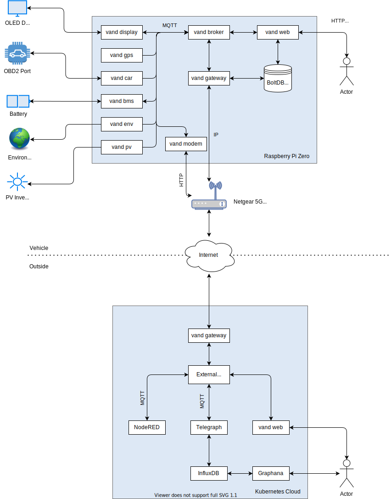

<!--
SPDX-FileCopyrightText: 2023 Steffen Vogel <post@steffenvogel.de>
SPDX-License-Identifier: Apache-2.0
-->

    
    <h1 align="center">VAN daemon</h1>

## 🚧 VANd is currently under-development

[VANd][vand] is a set of Micro-services to monitor and control a camper van / RV.

## Architecture

## Features

- GPS tracking
  - for NMEA GPS modules
- Battery-managment System monitoring
  - for JBD SmartBMS
- Solar / PV monitoring
  - for Renogy Rover MPPT chargers
- Wifi/Internet connectivity monitoring
  - for NETGEAR Nighthawk LTE routers
- Vehicle monitoring
  - via OBD2 port
- User-interfaces
  - small OLED display for quick glance state
  - embedded React Web-interface

## Getting started

To use VANd follow these steps:

1. Prepare a fresh Raspberry Pi running at least Debian Bullseye.
2. [Make the Raspberry Pi accessible via SSH.](https://www.raspberrypi.com/documentation/computers/remote-access.html)
3. Make sure you have a working Go toolchain installed (Go >= 1.18).
4. Adjust the configuration file [`etc/vand.yaml`](etc/vand.yaml).
5. Install VANd on the Raspberry Pi by running: `make deploy TARGET_HOST=root@192.0.2.1` (where `192.0.2.1` is the IP address of the device).

## Documentation

Documentation of ɯice can be found in the [`docs/`](./docs) directory.

## Authors

- Steffen Vogel ([@stv0g](https://github.com/stv0g), Institute for Automation of Complex Power Systems, RWTH Aachen University)

## License

ɯice is licensed under the [Apache 2.0](./LICENSE) license.

Copyright 2022, Steffen Vogel

[vand]: https://github.com/stv0g/vand
